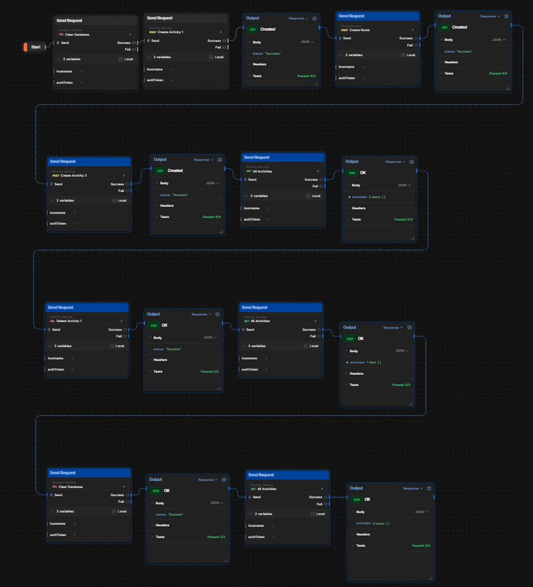
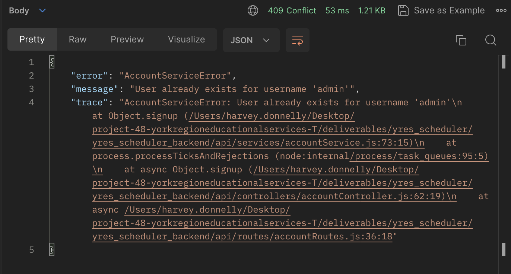

# YRES Scheduler: Backend API

The **YRES Scheduler Backend API** implements the core logic and functionality of the [YRES Scheduler](../../..) application. It serves as a [RESTful API](https://aws.amazon.com/what-is/restful-api/#:~:text=RESTful%20API%20is%20an%20interface,applications%20to%20perform%20various%20tasks.) with which the [YRES Frontend](../yres_scheduler_frontend/) can communicate via HTTP requests in order to support the operation of the YRES scheduler.

## Table of Contents
1. [Getting Started](#getting-started)
    - [Setup Instructions](#setup)
    - [Configuration](#configuration)
    - [Running Tests](#running-tests)
2. [Architecture and Design](#architecture-and-design)
    - [Architecture](#architecture)
    - [Package Structure](#package-structure)
    - [Testing](#testing)
    - [Error Handling](#error-handling)
4. [Coding Practices](#coding-practices)
5. [Documentation and Resources](#documentation-and-resources)

## Getting started
### Setup
1.	Ensure the latest version of Node.JS with NPM is installed. The site can be found [here](https://nodejs.org/en)
2.	Clone the project repository with the following URL: (https://github.com/csc301-2023-fall/project-48-yorkregioneducationalservices-T.git)
3.	Navigate to the directory following directory in the project and install the dependencies using the command `npm install`: (./deliverables/yres_scheduler/yres_scheduler_backend)
4.	Finally, to start the backend API, use the command `node server.js` while in the same directory as above.

### Configuration
We store a config file (./deliverables/yres_scheduler/yres_scheduler_backend/config), which contains particular information for running the application.
In the config JSON file(s), we store information about the server (the port number it is hosted on), the database (including host address. If running the server locally, change “HOST” to “localhost”), authentication information, and additional constants (such as the singular campus id, and the number of students/counselors in a group).

### Running Tests
We have a series of automated tests for entity creation stored in the project, which can be run while in the same directory as defined in the above setup section (./deliverables/yres_scheduler/yres_scheduler_backend), using the command `npm test`. 

Additionally, we have set up a public testing workspace using Postman to test the various services our backend API should support. The workspace can be found [here](https://www.postman.com/csc301-group-48/workspace/scheduler-api), where a window such as the one shown below should be seen:
 

To be able to run the tests, you must be in the “CSC301-group-48” Postman team (accessible in the top right) and have the environment set to “Local” (in the above screenshot, this is changed where it says “No Environment”).
On the left sidebar, there are several tabs. 
-	The Collections tab contains tests for each service we have defined (these are folders of individual tests that perform one specific function).
-	The Environments tab contains specific environment variables which we have defined to be used in our tests. 
-	The Flows tab contains several flowcharts corresponding to each of the services used by the application regularly, which run the tests defined in the Collections tab in the desired order to replicate the correct behaviour of the application.
To run the tests, the user must be logged in with a Postman account, and they should have the backend API running [locally] as described in the Setup section (i.e. using the command `node server.js`).

NOTE: Tests cannot be run on the browser version of Postman without the Postman Desktop Agent Installed.

The services are meant to be tested using the flows. An image is provided below with an example of how the flow test: 

## Architecture and Design

### Architecture
The design of the YRES Scheduler Backend API aims to follow a hybrid [CLEAN](https://blog.cleancoder.com/uncle-bob/2012/08/13/the-clean-architecture.html) and [service-oriented](https://aws.amazon.com/what-is/service-oriented-architecture/#:~:text=you%20implement%20microservices%3F-,What%20is%20service%2Doriented%20architecture%3F,other%20across%20platforms%20and%20languages.) architecture, whereby guidelines are borrowed from both approaches. Use cases are placed into relevant groupings called _services_, typically corresponding to operations relating to an entity (e.g. the student service manages most operations directly related to the student entity). The platform is also divided into hierarchical layers of abstraction, each with specific responsibilities.

*Backend API Higher-level Design Diagram*

The innermost layer, _Enterprise Business Rules_, defines attributes and  behaviour for all entities that are relevant to the scheduler application (e.g. activity, student etc). [Entities](./api/entities/) are data structures that provide a common language for data to be manipulated across services and use cases. The _Application Business Rules_ layer is where use case logic is implemented for corresponding API requests. [Service modules](./api/services/) export a functions for each API endpoint in their corresponding service. These modules throw informative service-specific errors and may call corresponding DB gateway plugins. Each service also has a corresponding [DB gateway plugin](./api/db/), which implements operations related to querying and manipulating persistant storage, formatting the raw data into the relevant entities.

The _Interface Adapters_ layer is where the unpacking of raw inputs (i.e. request body and query parameters) and preparation of response objects is handled. [Controllers](./api/controllers/), which also act as presenters, call the corresponding service module function. [Routers](./api/routes/) specify the routes, request contracts, and any custom middleware for each API endpoint and are responsible for calling the corresponding controller. [Middleware](./api/middleware/), such as the [Error Handler](./api/middleware/errorHandler.js) and [Authentication Handler](./api/middleware/authHandler.js) are inserted like intermediate layers between the routers and controllers.

### Package Structure
The main components and structure of the YRES Scheduler Backend API package is mapped below:

API

- **[api](./api)**

    

    
Controllers

    - **[controllers](./api/controllers)**
        - **[accountController](./api/controllers/accountController.js)**
        - **[activityController](./api/controllers/activityController.js)**
        - **[blockController](./api/controllers/blockController.js)**
        - **[campController](./api/controllers/campController.js)**
        - **[campusController](./api/controllers/campusController.js)**
        - **[counselorController](./api/controllers/counselorController.js)**
        - **[groupController](./api/controllers/groupController.js)**
        - **[roomController](./api/controllers/roomController.js)**
        - **[scheduleController](./api/controllers/scheduleController.js)**
        - **[studentController](./api/controllers/studentController.js)**

    

    

    
DB Gateway Plugins

    - **[db](./api/db)**
        - **[accountDbPlugin](./api/db/accountDbPlugin.js)**
        - **[activityDbPlugin](./api/db/activityDbPlugin.js)**
        - **[blockDbPlugin](./api/db/blockDbPlugin.js)**
        - **[campDbPlugin](./api/db/campDbPlugin.js)**
        - **[campusDbPlugin](./api/db/campusDbPlugin.js)**
        - **[counselorDbPlugin](./api/db/counselorDbPlugin.js)**
        - **[groupDbPlugin](./api/db/groupDbPlugin.js)**
        - **[roomDbPlugin](./api/db/roomDbPlugin.js)**
        - **[scheduleDbPlugin](./api/db/scheduleDbPlugin.js)**
        - **[studentDbPlugin](./api/db/studentDbPlugin.js)**
    

    
    

    
Entities

    - **[entities](./api/entities)**
        - **[Activity](./api/entities/Activity.js)**
        - **[AdminUser](./api/entities/AdminUser.js)**
        - **[Block](./api/entities/Block.js)**
        - **[Camp](./api/entities/Camp.js)**
        - **[Campus](./api/entities/Campus.js)**
        - **[Counselor](./api/entities/Counselor.js)**
        - **[Group](./api/entities/Group.js)**
        - **[Room](./api/entities/Room.js)**
        - **[Schedule](./api/entities/Schedule.js)**
        - **[ServiceErrors](./api/entities/ServiceErrors.js)**
        - **[Student](./api/entities/ServiceErrors.js)**
    

    

    
Middleware

    - **[middleware](./api/middleware)**
        - **[authHandler](./api/middleware/authHandler.js)**
        - **[errorHandler](./api/middleware/errorHandler.js)**
    

    

    
Routers:

    - **[routes](./api/routes)**
        - **[accountRoutes](./api/routes/accountRoutes.js)**
        - **[activityRoutes](./api/routes/activityRoutes.js)**
        - **[blockRoutes](./api/routes/blockRoutes.js)**
        - **[campRoutes](./api/routes/campRoutes.js)**
        - **[campusRoutes](./api/routes/campusRoutes.js)**
        - **[counselorRoutes](./api/routes/counselorRoutes.js)**
        - **[groupRoutes](./api/routes/groupRoutes.js)**
        - **[roomRoutes](./api/routes/roomRoutes.js)**
        - **[scheduleRoutes](./api/routes/scheduleRoutes.js)**
        - **[studentRoutes](./api/routes/studentRoutes.js)**
    

    

    
Services:

    - **[services](./api/services)**
        - **[accountService](./api/services/accountService.js)**
        - **[activityService](./api/services/activityService.js)**
        - **[blockService](./api/services/blockService.js)**
        - **[campService](./api/services/campService.js)**
        - **[campusService](./api/services/campusService.js)**
        - **[counselorService](./api/services/counselorService.js)**
        - **[groupService](./api/services/groupService.js)**
        - **[roomService](./api/services/roomService.js)**
        - **[scheduleService](./api/services/scheduleService.js)**
        - **[studentService](./api/services/studentService.js)**

            

            
Algorithms:

            - **[algo](./api/services/algo)**
                - **[accountService](./api/services/algo/scheduleAlgo.js)**
                - **[activityService](./api/services/algo/groupAlgo.js)**
            

    

- **[config](./config)**
- **[logging](./logging)**
- **[app.js](./app.js)**
- **[logger.js](./logger.js)**
- **[server.js](./server.js)**

### Testing
The YRES Scheduler API utilises three means of testing:

1. **Automated Unit Tests:** Used to test the core logic of the entities using the [Mocha testing framework](https://mochajs.org). These can be found in the [tests](./api/tests/entities/) directory.

2. **Postman Per-request Test Scripts:** Used to test properties of request and response objects, validating the request body and status codes. These are implemented using [Postman](https://learning.postman.com/docs/writing-scripts/test-scripts/) test scripts in our bespoke postman collection. These tests can be accessed from the [Backend API Postman Collection](https://www.postman.com/csc301-group-48/workspace/scheduler-api/request/30499092-3f1b5bba-bca3-46c8-8b68-b194d4812e3a).

3. **Postman Flows Request-Chaining Tests:** Used to test chaining multiple requests in a [postman flow](https://learning.postman.com/docs/writing-scripts/test-scripts/), verifying end-to-end functionality for specific services. These tests can be run manually and accessed from the [Backend API Postman Collection](https://www.postman.com/csc301-group-48/workspace/scheduler-api/request/30499092-3f1b5bba-bca3-46c8-8b68-b194d4812e3a).

### Error Handling
The YRES Scheduler Backend API implements an informative and flexible error-handling system. The application defines a custom Express middleware for [error handling](./api/middleware/errorHandler.js). This ensures consistent formatting of error responses, setting custom status codes as appropriate and including relevant information about the error (e.g. the related service, a descriptive message etc). Each service has a corresponding custom error object which is contained within the [Service Errors](./api/entities/ServiceErrors.js) entity. Service errors should be thrown within service files by convention, although the error handling middleware will gracefully handle errors regardless of where they are thrown in the request-response flow of control.

*Graceful Error Handling*

## Coding Practices
The team followed JSDoc practices for documenting the code, which can be read [here](https://jsdoc.app/).

The team’s approach to designing the backend API employed a variation of clean architecture design (explained more in detail in the Architecture and Design section of this document), where each service begins its use case by receiving a request at its corresponding router file, sending the data down to the controller, which calls a function defined in the service file containing use case logic and may additionally call a database plugin to access/modify stored data. A response from the plugin is then passed back up along the chain and sent back to the front end of the project to be shown to the user.

Every type of request being handled follows the same architectural format with an entry in the router, controller, service and possibly database plugin files corresponding to the entities involved with the request. If a new type of request is to be supported, it would come with a new, parallel entry in the existing files for the entity being accessed, or within new files following the same design if the request does not fit in any of the existing paths.
Additionally, any changes made to the back end of the project are checked for refactoring with the front end. A document detailing the front end of the project can be found [here](../yres_scheduler_frontend/README.md).

## Documentation and Resources
-	[Project repository page](https://github.com/csc301-2023-fall/project-48-yorkregioneducationalservices-T.git)
-	[York Region Educational Services Home Page](https://yorkeducation.org/)
-	[Node.JS Official Website](https://nodejs.org/en)
-	[JSDoc Documentation](https://jsdoc.app/)
-	[PostgreSQL Official Website](https://www.postgresql.org/)
-	[Project Postman testing workspace](https://www.postman.com/csc301-group-48/workspace/scheduler-api)
- [Project Database README](../yres_scheduler_database/README.md)
